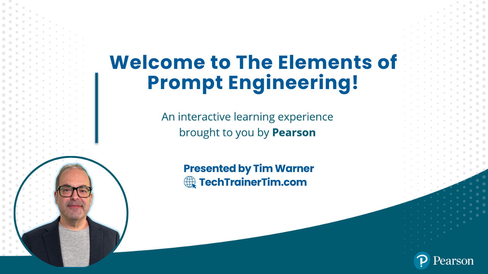

# The Elements of Prompt Engineering Live Online Training Course

  

  
  
  

  Repository short link: <a href="https://timw.info/elements">timw.info/elements</a>

## 📬 Connect with Tim

> 🌐 **Primary Contact:** Visit [techtrainertim.com](https://techtrainertim.com) for all my social links and latest content!

Additional Contact Methods

- 👨‍💻 [GitHub](https://github.com/timothywarner)
- 💼 [LinkedIn](https://www.linkedin.com/in/timothywarner/)
- 📧 [Email](mailto:timothywarner316@gmail.com)
- 🦋 [Bluesky](https://bsky.app/profile/techtrainertim.bsky.social)

## 🎯 Essential AI Services

- [OpenAI ChatGPT](https://chat.openai.com/) - AI assistant for conversation and task completion
- [OpenAI Documentation](https://platform.openai.com/docs) - Official API docs and guides
- [Google Gemini](https://gemini.google.com/) - Google's multimodal AI model
- [Google AI Studio](https://aistudio.google.com/) - Build with Gemini models
- [Anthropic Claude](https://claude.ai/) - AI assistant focused on helpful, harmless, and honest interactions
- [Anthropic Documentation](https://docs.anthropic.com/) - Claude API and safety resources
- [Microsoft 365 Copilot](https://www.microsoft.com/en-us/microsoft-365/copilot) - AI-powered productivity assistant for Microsoft 365
- [Microsoft 365 Copilot Documentation](https://learn.microsoft.com/en-us/microsoft-365-copilot/) - Setup and usage guides
- [GitHub Copilot](https://github.com/features/copilot) - AI pair programmer for developers
- [GitHub Copilot Documentation](https://docs.github.com/en/copilot) - Getting started and best practices

## 🔧 Vendor-Specific Guides

- [OpenAI Prompt Engineering Guide](https://platform.openai.com/docs/guides/prompt-engineering) - Official OpenAI best practices
- [OpenAI GPT-4 Technical Report](https://cdn.openai.com/papers/gpt-4.pdf) - Technical details and capabilities
- [Anthropic Claude Prompt Engineering](https://docs.anthropic.com/en/docs/prompt-engineering) - Claude-specific prompting techniques
- [Anthropic Constitutional AI](https://www.anthropic.com/research/constitutional-ai) - Safety-focused AI principles
- [Google AI Prompt Best Practices](https://ai.google.dev/docs/prompt_best_practices) - Google's guidelines for effective prompting
- [Google Gemini API Guide](https://ai.google.dev/docs/gemini_api_overview) - Gemini API documentation and examples
- [Microsoft AI Builder Prompts](https://learn.microsoft.com/en-us/ai-builder/prompts-overview) - Microsoft's prompt design patterns
- [Microsoft Semantic Kernel](https://learn.microsoft.com/en-us/semantic-kernel/) - AI orchestration framework
- [AWS Prompt Engineering Guide](https://aws.amazon.com/what-is/prompt-engineering/) - Amazon's approach to prompt engineering
- [AWS Bedrock Prompt Engineering](https://docs.aws.amazon.com/bedrock/latest/userguide/prompt-engineering.html) - Bedrock-specific prompting
- [Meta Llama Prompt Engineering](https://ai.meta.com/llama/get-started/) - Llama model prompting guide
- [Cohere Prompt Engineering](https://docs.cohere.com/docs/prompt-engineering) - Cohere's prompting best practices
- [Hugging Face Prompt Engineering](https://huggingface.co/docs/transformers/main_classes/text_generation) - Transformers library guidance

## 🛠️ Recommended LLM Services

- [Perplexity](https://www.perplexity.ai/) - AI-powered search and discovery
- [Cursor](https://www.cursor.com/) - AI-enhanced development environment
- [Kagi Universal Summarizer](https://kagi.com/summarizer) - Advanced text summarization tool
- [Midjourney](https://www.midjourney.com/) - AI image generation and art creation
- [SlidesGPT](https://slidesgpt.com/) - AI-powered presentation generation
- [ElevenLabs](https://elevenlabs.io/) - AI voice synthesis and text-to-speech
- [Heygen](https://www.heygen.com/) - AI video generation and avatar creation
- [Poppy AI](https://poppy.ai/) - AI-powered content creation and automation
- [Gamma AI](https://gamma.app/) - AI presentation and document creation
- [Cline AI](https://cline.ai/) - AI-powered code generation and assistance
- [Windsurf AI](https://windsurf.ai/) - AI-powered data analysis and visualization
- [Sora](https://openai.com/sora) - OpenAI's text-to-video generation model
- [Operator](https://operator.com/) - AI-powered business automation platform

## 📚 Learning Resources

- [OpenAI Cookbook](https://cookbook.openai.com/) - Practical prompt engineering recipes
- [Anthropic Claude Documentation](https://docs.anthropic.com/) - Advanced prompting techniques
- [Prompt Engineering Guide](https://www.promptingguide.ai/) - Comprehensive learning resource
- [Microsoft Learn AI Skills Challenge](https://learn.microsoft.com/en-us/training/challenges?id=ai-skills) - Microsoft AI training
- [Google AI Learning Path](https://cloud.google.com/learn/training/machinelearning-ai) - Google AI education
- [AWS Machine Learning University](https://aws.amazon.com/machine-learning/mlu/) - AWS ML training

## 🏢 Microsoft AI Stack

- [Azure OpenAI Service](https://azure.microsoft.com/en-us/products/ai-services/openai-service) - Enterprise OpenAI models on Azure
- [Copilot Studio](https://www.microsoft.com/en-us/copilot/microsoft-copilot-studio) - Build custom copilots and AI agents
- [Azure AI Services](https://azure.microsoft.com/en-us/products/ai-services) - Complete AI service portfolio
- [M365 Copilot Development](https://learn.microsoft.com/en-us/microsoft-365-copilot/extensibility/) - Extend Microsoft 365 Copilot

## 🖼️ LLM Galleries

- [Hugging Face](https://huggingface.co/) - Open-source model hub and community
- [Ollama](https://ollama.com/) - Local LLM deployment and management
- [Kagi](https://kagi.com/) - AI-powered search engine
- [You.com](https://you.com/) - AI search and chat platform
- [GitHub Models](https://github.com/topics/large-language-models) - LLM repositories on GitHub
- [GitHub Copilot Extensions](https://github.com/marketplace?category=developer-tools&type=apps&query=copilot) - Copilot marketplace extensions

## 🔍 Search & Development Tools

- [Kagi Universal Summarizer](https://kagi.com/summarizer) - Advanced text summarization
- [Perplexity Labs](https://labs.perplexity.ai/) - AI research and experimentation
- [Claude Search](https://claude.ai/search) - Claude-powered search
- [GitHub Copilot Documentation](https://docs.github.com/en/copilot) - Copilot development guide
- [Cursor Documentation](https://cursor.sh/docs) - Cursor IDE documentation
- [Amazon CodeWhisperer](https://aws.amazon.com/codewhisperer/) - AWS code generation

## 🛡️ Responsible AI Principles

- [Microsoft Responsible AI Standards](https://www.microsoft.com/en-us/ai/responsible-ai)
- [OpenAI Safety & Responsibility](https://openai.com/safety)
- [Google AI Principles](https://ai.google/responsibility/principles/)
- [AWS Responsible AI](https://aws.amazon.com/machine-learning/responsible-ai/)
- [Anthropic AI Safety](https://www.anthropic.com/safety)
- [Meta AI Safety](https://ai.meta.com/responsible-ai/) - Meta's responsible AI approach
- [IBM AI Ethics](https://www.ibm.com/artificial-intelligence/ethics) - IBM's AI ethics framework
- [UNESCO AI Ethics](https://www.unesco.org/en/artificial-intelligence/recommendation-ethics) - Global AI ethics framework
- [OECD AI Principles](https://oecd.ai/en/ai-principles) - International AI policy principles

## 🔗 Model Context Protocol (MCP)

- [MCP Official Specification](https://modelcontextprotocol.io/) - Official MCP documentation and spec
- [MCP GitHub Repository](https://github.com/modelcontextprotocol) - Official MCP GitHub organization
- [MCP Server Gallery](https://modelcontextprotocol.io/servers) - Collection of MCP servers and tools
- [MCP Python SDK](https://github.com/modelcontextprotocol/python-sdk) - Python implementation
- [MCP TypeScript SDK](https://github.com/modelcontextprotocol/typescript-sdk) - TypeScript implementation
- [MCP Rust SDK](https://github.com/modelcontextprotocol/rust-sdk) - Rust implementation
- [MCP Server Examples](https://github.com/modelcontextprotocol/servers) - Example MCP server implementations

## 💡 Tim's LLM Prompting Guidance

- Maintain at least 2 "daily driver" LLMs at a paid tier for A/B testing (fault tolerance and groundedness)
- Never provide personal or confidential information to public/free AIs—ensure privacy by understanding chat storage, usage stats, and licensing policies
- Speak to the LLM in ways most comfortable to you (voice, text, image) and take advantage of its multi-modal capabilities
- Apply a stream-of-consciousness technique to generate prompts, even with rough spelling/grammar, including key information like who, what, when, where, why, and how
- Think procedurally and in a step-by-step manner to help the AI break down complex topics
- Optimize custom instructions and prompts ("meta prompting"), including asking the AI to summarize or focus its responses
- Use system prompts and meta prompts to direct and focus the LLM's capabilities
- Be aware of potential signs of amnesia or hallucination in AI responses; have a backup plan (such as testing with multiple LLMs)
- Accept that you'll never be fully caught up—embrace exploration, questioning, and constant testing
- Build cognitive "muscle memory" with AI by practicing prompt refinement and cross-model comparisons
- Remember to attribute AI-enriched content where relevant
- Understand the unique strengths and behaviors of each LLM and leverage them strategically in multi-chat sessions
- "LLM Pillar Jumping": Use insights from one LLM session to support or refine another
- Consider "A/B testing" LLMs against each other for more grounded and reliable answers
- Get vulnerable with your AI (in trusted, secure sessions) to receive maximally personalized results—the more context you provide about your unique situation, the more tailored and valuable the response
- Leverage "meta-prompting" by asking the AI to craft system messages, design prompts, and optimize instructions—let the AI help you become better at using AI

## 📖 Tim's Essential Tech Writing Bookshelf

- [Internet Archive (search for the books here)](https://openlibrary.org/)
- [The Elements of Style](https://www.amazon.com/Elements-Style-Fourth-William-Strunk/dp/020530902X)
- [Editor-Proof Your Writing](https://www.amazon.com/Editor-Proof-Your-Writing-Publishers-Writers/dp/1610351789)
- [Yahoo Style Guide](https://www.amazon.com/Yahoo-Style-Guide-Ultimate-Sourcebook/dp/031256984X)

