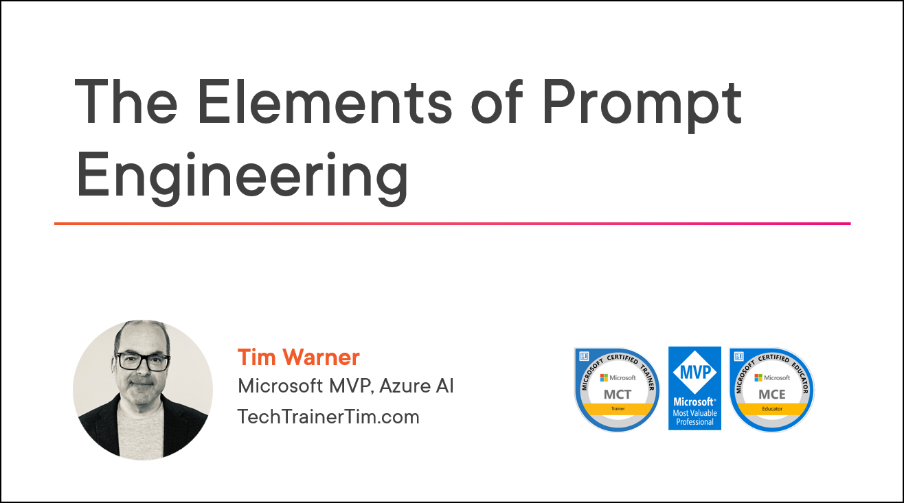

# The Elements of Prompt Engineering Live Online Training Course

Repository short link: [timw.info/elements](https://timw.info/elements)

## Contact information

- [GitHub](https://github.com/timothywarner)
- [LinkedIn](https://www.linkedin.com/in/timothywarner/)
- [Email](mailto:timothywarner316@gmail.com)
- [Website](https://techtrainertim.com)
- [Bluesky](https://bsky.app/profile/techtrainertim.bsky.social)

## Latest links from Tim

- [Awesome Prompt Engineering](https://github.com/promptslab/Awesome-Prompt-Engineering)
- [Prompting Guide Datasets](https://www.promptingguide.ai/datasets)
- [Microsoft PromptBase](https://github.com/microsoft/promptbase)

## Tim's LLM Prompting Guidance

- Maintain at least 2 "daily driver" LLMs at a paid tier for A/B testing (fault tolerance and groundedness)
- Never provide personal or confidential information to public/free AIs—ensure privacy by understanding chat storage, usage stats, and licensing policies
- Speak to the LLM in ways most comfortable to you (voice, text, image) and take advantage of its multi-modal capabilities
- Apply a stream-of-consciousness technique to generate prompts, even with rough spelling/grammar, including key information like who, what, when, where, why, and how
- Think procedurally and in a step-by-step manner to help the AI break down complex topics
- Optimize custom instructions and prompts ("meta prompting"), including asking the AI to summarize or focus its responses
- Use system prompts and meta prompts to direct and focus the LLM's capabilities
- Be aware of potential signs of amnesia or hallucination in AI responses; have a backup plan (such as testing with multiple LLMs)
- Accept that you'll never be fully caught up—embrace exploration, questioning, and constant testing
- Build cognitive "muscle memory" with AI by practicing prompt refinement and cross-model comparisons
- Remember to attribute AI-enriched content where relevant
- Understand the unique strengths and behaviors of each LLM and leverage them strategically in multi-chat sessions
- "LLM Pillar Jumping": Use insights from one LLM session to support or refine another
- Consider "A/B testing" LLMs against each other for more grounded and reliable answers

## Tim's Essential Tech Writing Bookshelf

- [Internet Archive (search for the books here)](https://openlibrary.org/)
- [The Elements of Style](https://www.amazon.com/Elements-Style-Fourth-William-Strunk/dp/020530902X)
- [Editor-Proof Your Writing](https://www.amazon.com/Editor-Proof-Your-Writing-Publishers-Writers/dp/1610351789)
- [Yahoo Style Guide](https://www.amazon.com/Yahoo-Style-Guide-Ultimate-Sourcebook/dp/031256984X)

## Prompting guidance

### OpenAI
- [Prompt engineering](https://platform.openai.com/docs/guides/prompt-engineering)

### Microsoft
- [Overview of prompts](https://learn.microsoft.com/en-us/ai-builder/prompts-overview)

### Google
- [Prompt design strategies](https://ai.google.dev/docs/prompt_best_practices)

### Amazon
- [What is Prompt Engineering?](https://aws.amazon.com/what-is/prompt-engineering/)

### Third Party
- [Prompt Engineering Guide](https://www.promptingguide.ai/)

## LLM galleries

- [Hugging Face](https://huggingface.co/)
- [Ollama](https://ollama.com/)
- [Kagi](https://kagi.com/)
- [You.com](https://you.com/)
- GitHub Models
- GitHub Copilot Extensions

## Community and third-party resources

- [Perplexity](https://www.perplexity.ai/)
- [Cursor](https://www.cursor.com/)
- [Noi](https://github.com/lencx/Noi)
- [Backplain](https://backplain.com)

## LLM vendors responsible AI principles

- [Microsoft Responsible AI Standards](https://www.microsoft.com/en-us/ai/responsible-ai)
- [OpenAI Safety & Responsibility](https://openai.com/safety)
- [Google AI Principles](https://ai.google/responsibility/principles/)
- [AWS Responsible AI](https://awss.amazon.com/machine-learning/responsible-ai/)
- [Anthropic AI Safety](https://www.anthropic.com/safety)

## Additional LLM Resources

### Search Tools
- [Kagi Universal Summarizer](https://kagi.com/summarizer)
- [Perplexity Labs](https://labs.perplexity.ai/)
- [Claude Search](https://claude.ai/search)

### Development Tools
- [GitHub Copilot Documentation](https://docs.github.com/en/copilot)
- [Cursor Documentation](https://cursor.sh/docs)
- [Amazon CodeWhisperer](https://aws.amazon.com/codewhisperer/)

### Learning Resources
- [Microsoft Learn AI Skills Challenge](https://learn.microsoft.com/en-us/training/challenges?id=ai-skills)
- [Google AI Learning Path](https://cloud.google.com/learn/training/machinelearning-ai)
- [AWS Machine Learning University](https://aws.amazon.com/machine-learning/mlu/)
- [OpenAI Cookbook](https://cookbook.openai.com/)
- [Anthropic Claude Documentation](https://docs.anthropic.com/)

### AI Safety & Ethics
- [AI Safety Resources (Anthropic)](https://www.anthropic.com/research)
- [Microsoft AI Safety Report](https://blogs.microsoft.com/on-the-issues/2023/06/08/microsoft-ai-safety-framework-responsible-ai-development/)
- [Google AI Safety First Approach](https://ai.google/responsibility/safety-first/)

